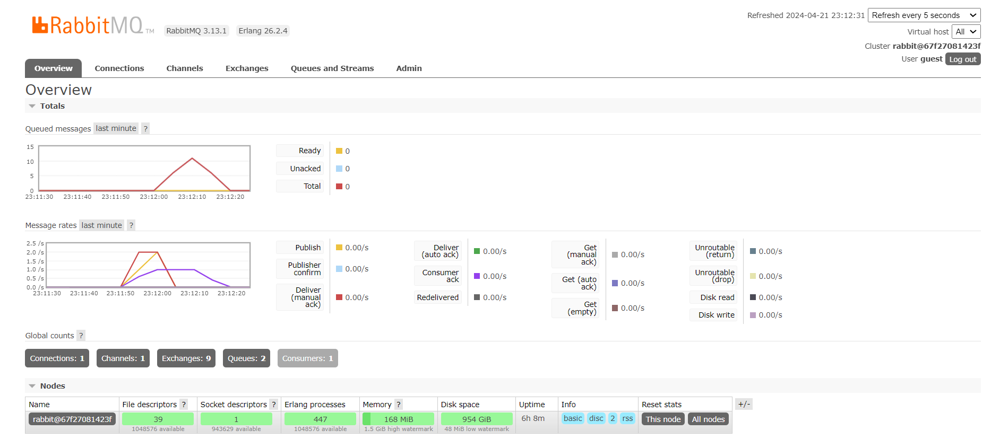
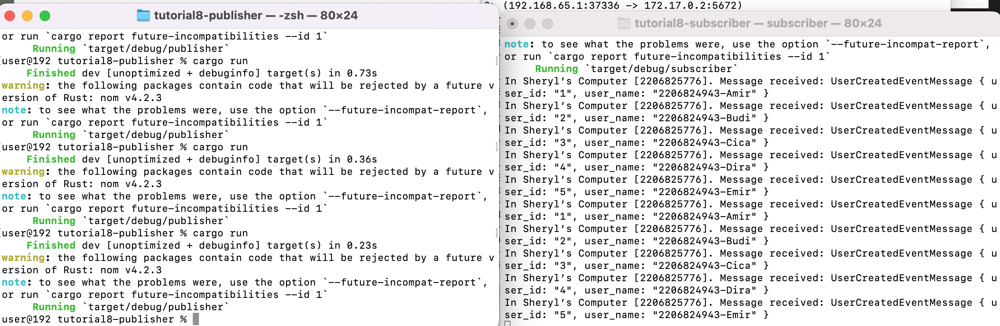
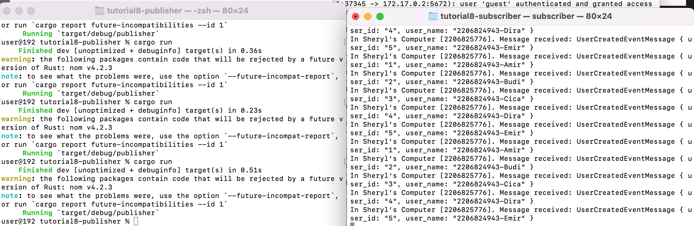
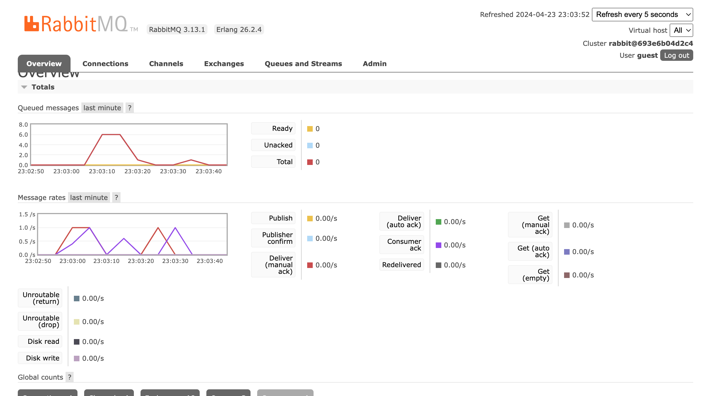

# Tutorial 8 (SUBSCRIBER)
Nama: Sheryl Ivana Widjaja
NPM: 2206824943
Kelas: Pemrograman Lanjut - A

---
## REFLEKSI 1

###### 1. what is amqp?

AMQP adalah protokol untuk mengatur komunikasi antara sistem-sistem yang berbeda, terutama dalam konteks antrian pesan. Ini mendukung model penerbitan-pelanggan, antrian pesan, keandalan pengiriman, berbagai bentuk pertukaran pesan, dan berbagai jenis konten. AMQP digunakan luas dalam sistem yang memerlukan komunikasi yang handal dan terdistribusi, seperti perbankan dan layanan keuangan.

###### 2. what it means? guest:guest@localhost:5672, what is the first quest, and what is the second guest, and what is localhost:5672 is for? 
Pertama-tama, "guest:guest" adalah format yang umumnya digunakan untuk menyediakan kredensial (username dan password) untuk mengakses sistem atau layanan tertentu. Dalam konteks ini:

- "guest" adalah username (nama pengguna).
- "guest" (lagi) adalah password.

Selanjutnya, "localhost:5672" merujuk pada alamat dan port yang digunakan untuk mengakses layanan AMQP (Advanced Message Queuing Protocol) di mesin lokal (localhost). Dalam hal ini:

- "localhost" menunjukkan bahwa layanan AMQP berjalan pada mesin lokal, yaitu komputer tempat Anda sedang menggunakan perangkat lunak atau aplikasi yang terhubung dengan AMQP.
- "5672" adalah nomor port default untuk layanan AMQP. Port ini biasanya digunakan untuk mengakses dan berkomunikasi dengan broker pesan AMQP, seperti RabbitMQ.

Jadi, "guest:guest@localhost:5672" secara keseluruhan adalah cara untuk memberikan kredensial (username dan password) untuk mengakses layanan AMQP yang berjalan di mesin lokal pada port defaultnya. Ini adalah contoh umum yang sering digunakan dalam konfigurasi dan pengaturan aplikasi yang berinteraksi dengan broker pesan AMQP.

Di sini, terlihat bahwa antrian mencapai 11 karena saya menjalankan cargo run sebanyak 4 kali.

melakukan cargo run pada publisher dan subscriber sebanyak 2 kali

melakukan cargo run pada publisher dan subscriber sebanyak 3 kali

Screenshot hasil spike dari message queue berkurang yang menunjukkan peningkatan kecepatan dari sebelumnya karena request yang diterima queue dapat dibagi kepada 3 subscriber. 

code unwrap
* Disarankan untuk menghindari penggunaan `unwrap()` karena dalam kode produksi, penggunaannya bisa menyebabkan panic jika terjadi kesalahan pada hasilnya. Lebih baik menggunakan struktur kontrol seperti `match` atau `if let` untuk menangani kesalahan ini secara lebih elegan dan terkontrol.

* Selain itu, sebagai alternatif, kita bisa mendefinisikan string yang sering digunakan sebagai konstanta pada bagian awal file. Ini akan membuat kode menjadi lebih mudah dipahami, tersusun, dan menghindari pengulangan yang tidak diperlukan.